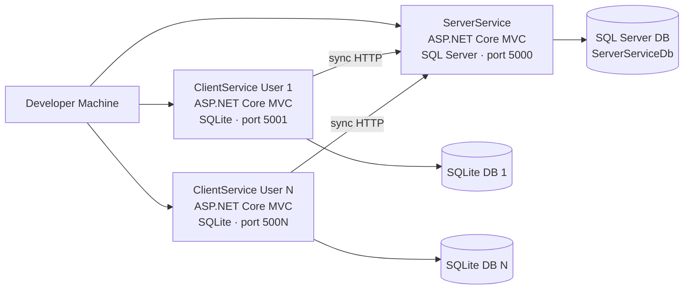
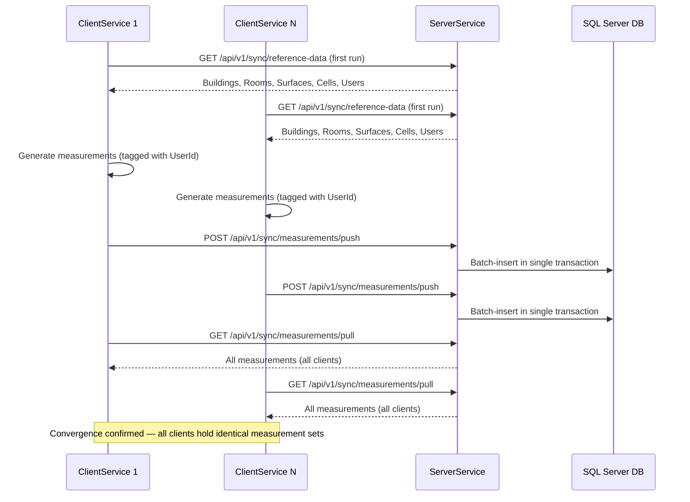

# Microserices-Sync

Local development environment for multi-client sync experiments.

## Prerequisites

| Tool | Version / Note |
|---|---|
| [Docker Desktop](https://www.docker.com/products/docker-desktop/) | Latest stable — required to run all services |
| [Git](https://git-scm.com/) | Any recent version — required to clone the repository |
| [.NET 10 SDK](https://dotnet.microsoft.com/download) | Required only if running or building outside Docker (optional for Docker-only workflow) |
| [Visual Studio 2022 (17.12+)](https://visualstudio.microsoft.com/vs/) or [VS Code](https://code.visualstudio.com/) | Required for local debugging outside containers; Visual Studio is the primary dev environment |
| [SQL Server Management Studio (SSMS)](https://aka.ms/ssms) | Optional — required for Direct Database Inspection of SQL Server |
| [DB Browser for SQLite](https://sqlitebrowser.org) | Optional — required for Direct Database Inspection of SQLite |

> SSMS and DB Browser are needed only if you want to inspect databases directly (see [Direct Database Inspection](#direct-database-inspection)). They are not required to run the standard Docker scenario.

You will also need a `.env` file in this folder (see Quick Start below) — it is git-ignored and must be created manually on each machine.

## Quick Start

### Before your first run

1. **Clone the repository** (skip if you already have it locally):
   ```bash
   git clone <repository-url>
   cd <repository-folder>
   cd MicroservicesSync
   ```

2. **Create the required `.env` file** in the `MicroservicesSync/` folder (the same folder as `docker-compose.yml`):
   ```
   SA_PASSWORD=<YourStrong@Passw0rd>
   ```
   Replace `<YourStrong@Passw0rd>` with your chosen SQL Server password.  
   The password must meet SQL Server's complexity requirements:
   - At least 8 characters
   - Contains uppercase letters, lowercase letters, digits, and at least one symbol

   This file is git-ignored and must be created manually on each machine.  
   Without it, the `sqlserver` container will fail to start because `SA_PASSWORD` is undefined.

### Start the services

> Ensure Docker Desktop is running before executing these commands.

```bash
# First run / after code changes (first run downloads images and may take several minutes)
docker-compose up --build

# Subsequent runs (images already built)
docker-compose up

# Stop all containers
docker-compose down
```

## Verifying the Environment is Healthy

Once all containers are running, check each service's `/health` endpoint.
Every endpoint should return HTTP 200 with `{"status":"Healthy"}`.

| Service               | Health URL                          |
|-----------------------|-------------------------------------|
| ServerService         | http://localhost:5000/health        |
| ClientService user 1  | http://localhost:5001/health        |
| ClientService user 2  | http://localhost:5002/health        |
| ClientService user 3  | http://localhost:5003/health        |
| ClientService user 4  | http://localhost:5004/health        |
| ClientService user 5  | http://localhost:5005/health        |

You can also check container health status at a glance:

```bash
docker-compose ps
# All application containers should show (healthy) next to their running state.
```

A ClientService instance will report `{"status":"Unhealthy"}` (HTTP 503) if its
`ClientIdentity__UserId` environment variable is missing or not a valid GUID.

### Accessing the Service Home Pages

Once all health checks return `{"status":"Healthy"}`, open the service home pages in a browser to confirm the UI and data layer are fully operational (migrations applied, reference data seeded, UI rendering):

| Service | Home Page URL | What you should see |
|---|---|---|
| ServerService | http://localhost:5000 | jqGrid tables for Measurements, Buildings, Rooms, Surfaces, Cells, Users, and Sync Runs. On first run: 0 measurements, 5 users, 2 buildings, 4 rooms, 8 surfaces, 16 cells. |
| ClientService User 1 | http://localhost:5001 | jqGrid tables for Measurements (CRUD) and read-only reference grids. On first run: all tables empty until **Pull Reference Data** is triggered. Sync action buttons: **Generate**, **Push**, **Pull**, **Reset Client DB**, **Pull Reference Data**. |
| ClientService User 2–5 | http://localhost:5002 through http://localhost:5005 | Same as User 1 (each backed by its own isolated SQLite database). |

> Health endpoint checks (`/health`) confirm container liveness. The home page confirms end-to-end readiness: DB migrations applied, reference data seeded, and UI rendering correctly.

> If ServerService's home page loads but shows 0 rows in all grids with no error, seeding may still be in progress — wait 5–10 seconds and refresh. If tables remain empty after 30 seconds, check the `serverservice-app` logs with `docker logs serverservice-app --tail 30` for seeding errors.

## Scenario Parameters

Control experiment inputs via environment variables in `docker-compose.yml` — no recompilation needed.

| Environment Variable               | Config path (ASP.NET notation)              | Default | Description                                                       |
|------------------------------------|---------------------------------------------|---------|-------------------------------------------------------------------|
| `SyncOptions__MeasurementsPerClient` | `SyncOptions:MeasurementsPerClient`        | `10`    | Number of measurements generated per ClientService per scenario run |
| `SyncOptions__BatchSize`           | `SyncOptions:BatchSize`                     | `5`     | Records per in-memory batch during a push/pull sync operation     |

To override for a single run, edit the matching `environment:` entry under the relevant service in `docker-compose.yml`, then run `docker-compose up`.

### Changing Client Count

The default topology uses 5 ClientService instances (`clientservice_user1` through `clientservice_user5`), as defined in ADR-002.

To add a 6th client:
1. Copy any `clientservice_userN` block in `docker-compose.yml`, rename it `clientservice_user6`, and update the port mapping (`"5006:8080"`), SQLite path, `ClientIdentity__UserId` (new stable GUID), and volume names.
2. Add the matching volume declarations at the bottom of `docker-compose.yml`.
3. Ensure the GUID matches a seeded user entry (Story 1.4 seed data).

To remove a client: delete its service block and its volumes declaration.

## Reset to Clean Baseline

Use these steps to delete all measurements and restore each service to its fresh-install state
(ServerService re-seeded with reference data; each ClientService empty and ready to pull reference data).

**Prerequisites:** all containers running (`docker-compose up`).

**Step 1 — Reset ServerService** (deletes all measurements, re-seeds reference data):

```bash
curl -X POST http://localhost:5000/api/v1/admin/reset
```

Expected response: `{"message":"ServerService reset complete."}`

**Step 2 — Reset each ClientService** (repeat for ports 5001–5005):

```bash
curl -X POST http://localhost:5001/api/v1/admin/reset
curl -X POST http://localhost:5002/api/v1/admin/reset
curl -X POST http://localhost:5003/api/v1/admin/reset
curl -X POST http://localhost:5004/api/v1/admin/reset
curl -X POST http://localhost:5005/api/v1/admin/reset
```

Expected response: `{"message":"ClientService reset complete. Restart or trigger reference pull to reload reference data."}`

**Step 3 — Reload reference data on each ClientService** (or restart the containers):

```bash
curl -X POST http://localhost:5001/api/v1/admin/pull-reference-data
curl -X POST http://localhost:5002/api/v1/admin/pull-reference-data
curl -X POST http://localhost:5003/api/v1/admin/pull-reference-data
curl -X POST http://localhost:5004/api/v1/admin/pull-reference-data
curl -X POST http://localhost:5005/api/v1/admin/pull-reference-data
```

Expected response: `{"message":"Reference data loaded."}`

**Alternatively** — use the UI buttons on each service's home page:
- ServerService (`http://localhost:5000`): click **Reset to Baseline**
- Each ClientService (`http://localhost:5001` – `5005`): click **Reset Client DB**, then **Pull Reference Data**

**Expected clean state:**

| Entity        | ServerService | Each ClientService |
|---------------|---------------|--------------------|
| Users         | 5             | 5                  |
| Buildings     | 2             | 2                  |
| Rooms         | 4             | 4                  |
| Surfaces      | 8             | 8                  |
| Cells         | 16            | 16                 |
| Measurements  | 0             | 0                  |

> After a reset, the expected table counts listed in the [Direct Database Inspection](#direct-database-inspection) section serve as the verification baseline for direct DB queries.

## Running Sync Scenarios

> **Prerequisites for Scenario A:** All containers running (`docker-compose up`). Environment healthy (see [Verifying the Environment is Healthy](#verifying-the-environment-is-healthy)).
>
> **Prerequisites for Scenario B:** Containers stopped — you will start them with updated configuration in Step 1.

### Scenario A: Standard 5-Client × 10-Measurement Sync Run

This is the default scenario. No configuration changes are required — the docker-compose topology and environment defaults are pre-set for 5 clients × 10 measurements × batch size 5.

**Expected outcome:** After a complete push + pull cycle, ServerService and all 5 ClientService instances each hold **50 measurements** (5 clients × 10 measurements each).

**Step 1 — Reset to clean baseline**

Follow the [Reset to Clean Baseline](#reset-to-clean-baseline) steps to ensure all services start from a consistent state before running this scenario.

**Step 2 — Generate measurements (all 5 clients)**

On each ClientService home page (`http://localhost:5001` through `http://localhost:5005`), click **Generate Measurements**.

Expected result: a success message confirms 10 new measurements were created on that client, tagged with its own user identity.

> API alternative: `curl -X POST http://localhost:5001/api/v1/measurements/generate` (repeat for 5002–5005)

**Step 3 — Push measurements to ServerService (all 5 clients)**

On each ClientService home page, click **Push Measurements** (any order).

Expected result:
- Each push returns a success message.
- After all 5 clients push, the **Measurements** grid on `http://localhost:5000` shows **50 records**.

> API alternative: `curl -X POST http://localhost:5001/api/v1/measurements/push` (repeat for 5002–5005)

**Step 4 — Pull consolidated measurements (all 5 clients)**

On each ClientService home page, click **Pull Measurements** (any order).

Expected result: each ClientService **Measurements** grid shows **50 records** — including all measurements generated by the other four clients.

> API alternative: `curl -X POST http://localhost:5001/api/v1/measurements/pull` (repeat for 5002–5005)

**Step 5 — Verify convergence**

On each ClientService home page, click **Verify Convergence**.

Expected result: `✓ Converged: this client has 50 measurements, server has 50.`

For deeper verification (SQL-level row counts and duplicate checks), see [Direct Database Inspection](#direct-database-inspection). For batch and transaction log tracing, see [Viewing Sync Logs](#viewing-sync-logs). For diagnosing unexpected outcomes, see [Troubleshooting Unexpected Sync Outcomes](#troubleshooting-unexpected-sync-outcomes).

### Scenario B: Edge-Case 3-Client × 5-Measurement Reduced-Volume Variant

This variant exercises uneven batch sizes (remainder batch handling) and reduced client count to validate that transactional sync handles partial batches correctly.

**Configuration change required before starting.** Stop the environment first:

```bash
docker-compose down
```

Edit `docker-compose.yml`. In the `environment:` block for `clientservice_user1`, `clientservice_user2`, and `clientservice_user3`, locate the `SyncOptions__MeasurementsPerClient` and `SyncOptions__BatchSize` entries and set:

```yaml
- SyncOptions__MeasurementsPerClient=5
- SyncOptions__BatchSize=2
```

Leave `clientservice_user4` and `clientservice_user5` with their original defaults.

**Step 1 — Start the environment with updated configuration**

```bash
docker-compose up
```

**Step 2 — Reset all services to clean baseline**

Follow the [Reset to Clean Baseline](#reset-to-clean-baseline) steps to reset ServerService and all 5 ClientService instances. This ensures ServerService holds 0 measurements before clients 1–3 push — so the expected count of 15 is unambiguous regardless of any prior scenario run.

**Step 3 — Generate, push, and pull for clients 1–3 only**

On `http://localhost:5001`, `http://localhost:5002`, and `http://localhost:5003`:

1. Click **Generate Measurements** → expect 5 measurements per client.
2. Click **Push Measurements** → expect success.
3. After all 3 have pushed, the **Measurements** grid on ServerService (`http://localhost:5000`) should show **15 records** (3 × 5).
4. Click **Pull Measurements** on each of the three clients.
5. Click **Verify Convergence** → each should report `✓ Converged: this client has 15 measurements, server has 15.`

> Clients 4 and 5 (`http://localhost:5004`, `http://localhost:5005`) remain at baseline with 0 measurements, confirming client isolation.

**Step 4 — Restore default configuration**

Stop the environment, revert `docker-compose.yml` for clients 1–3 to the original values (`SyncOptions__MeasurementsPerClient=10` and `SyncOptions__BatchSize=5`), and restart as normal.

## Running Tests

```bash
dotnet test MicroservicesSync.Tests/MicroservicesSync.Tests.csproj
```

> To verify data correctness beyond the tests, see the [Direct Database Inspection](#direct-database-inspection) section below.

## Direct Database Inspection

Use the tools in this section to verify data correctness beyond the UI — useful when diagnosing sync issues or confirming that a scenario completed as expected.

### SQL Server (ServerService) — SSMS

SQL Server port `1433` is already exposed in `docker-compose.yml` (`ports: - "1433:1433"` under the `sqlserver` service) — no docker-compose changes are needed.

**SSMS connection parameters:**

| Parameter                | Value                                    |
|--------------------------|------------------------------------------|
| Server                   | `localhost,1433`                         |
| Authentication           | SQL Server Authentication                |
| Login                    | `sa`                                     |
| Password                 | Value from `.env` file (`SA_PASSWORD`)   |
| Trust Server Certificate | Checked (required — container uses a self-signed cert) |
| Database to explore      | `ServerServiceDb`                        |

**Key tables:**

| Table          | Description                                              |
|----------------|----------------------------------------------------------|
| `Measurements` | All measurements pushed by all clients                   |
| `SyncRuns`     | Summary records for each push/pull sync run (added in Story 3.1) |
| `Users`        | 5 seeded users; each has a stable `UserId` GUID          |
| `Buildings`    | 2 seeded buildings                                       |
| `Rooms`        | 4 seeded rooms                                           |
| `Surfaces`     | 8 seeded surfaces                                        |
| `Cells`        | 16 seeded cells                                          |

**Example diagnostic queries:**

```sql
-- Count measurements per user/client
SELECT UserId, COUNT(*) AS MeasurementCount
FROM Measurements
GROUP BY UserId
ORDER BY MeasurementCount DESC;

-- View all sync runs (most recent first)
SELECT OccurredAt, RunType, UserId, MeasurementCount, Status, ErrorMessage
FROM SyncRuns
ORDER BY OccurredAt DESC;

-- Verify convergence: compare ServerService measurement count with expected total
SELECT COUNT(*) AS TotalMeasurements FROM Measurements;
-- Expected after 5-client standard run: 5 clients × MeasurementsPerClient value
```

> **Note on `SyncedAt`:** In the `Measurements` table on the server, `SyncedAt` is always NULL by design — it is a client-side tracking field only. This is expected behaviour, not a data problem.

> **Note on `RowVersion`:** Most tables (`Measurements`, `Users`, `Buildings`, `Rooms`, `Surfaces`, `Cells`) include a `RowVersion` (`timestamp`) column used as a concurrency token. It is a binary value managed automatically by SQL Server — safe to ignore during inspection. `SyncRuns` does not have a `RowVersion` column.

### SQLite (ClientService) — DB Browser for SQLite

Recommended viewer: **DB Browser for SQLite** ([https://sqlitebrowser.org](https://sqlitebrowser.org)) — free, cross-platform, no login required.

Each ClientService container stores its SQLite database inside the container at `/app/SqLiteDatabase/<filename>`. Use `docker cp` to copy a snapshot to your host:

**Method A — Docker cp (recommended):**

```powershell
# For User 1:
docker cp clientservice-app-user1:/app/SqLiteDatabase/ClientServiceDbUser1.sqlite ./ClientServiceDbUser1.sqlite
# For User 2–5: substitute the container name and filename accordingly
# Container names: clientservice-app-user2, ..., clientservice-app-user5
# File names:       ClientServiceDbUser2.sqlite, ..., ClientServiceDbUser5.sqlite
```

**Method B — Bind-mount path (not applicable by default):**

> The default `docker-compose.yml` uses named volumes (not host bind mounts), so there is no host directory path to open directly. Method A (`docker cp`) is the canonical approach. The file extracted is a point-in-time snapshot — run `docker cp` again after additional sync activity to capture updated data.

**Key tables:**

| Table          | Description                                               |
|----------------|-----------------------------------------------------------|
| `Measurements` | This client's local measurements (may include synced)     |
| `Users`        | 5 users pulled from ServerService during reference sync   |
| `Buildings`    | 2 buildings pulled from ServerService                     |
| `Rooms`        | 4 rooms pulled from ServerService                         |
| `Surfaces`     | 8 surfaces pulled from ServerService                      |
| `Cells`        | 16 cells pulled from ServerService                        |

**Example diagnostic queries (SQLite):**

```sql
-- Count local measurements on this client
SELECT COUNT(*) FROM Measurements;

-- Inspect measurement details
SELECT Id, UserId, RecordedAt, SyncedAt, Value
FROM Measurements
ORDER BY RecordedAt DESC
LIMIT 20;

-- Verify reference data was pulled correctly
SELECT COUNT(*) FROM Users;      -- expected: 5
SELECT COUNT(*) FROM Buildings;  -- expected: 2
SELECT COUNT(*) FROM Rooms;      -- expected: 4
SELECT COUNT(*) FROM Surfaces;   -- expected: 8
SELECT COUNT(*) FROM Cells;      -- expected: 16
```

> **Note on `SyncedAt`:** In the ClientService `Measurements` table, `SyncedAt` is set to a UTC timestamp when a measurement was successfully **pushed** to ServerService by this client. A NULL value means either (a) the measurement was generated locally but not yet pushed, or (b) the measurement was **pulled** from another client — pulled measurements always arrive with `SyncedAt = null`.

> **Note on `ConcurrencyStamp`:** Tables include a `ConcurrencyStamp` (integer) column used as a concurrency token. Safe to ignore during inspection.

> For log-based diagnostics, see the **Viewing Sync Logs** section below.

## Viewing Sync Logs

Sync operations on both ServerService and ClientService emit structured log entries that include a **correlation ID**, user identity, operation type, measurement count, and success/failure status.

**Viewing logs via docker logs:**

```powershell
# ServerService logs (most recent 50 lines)
docker logs serverservice-app --tail 50

# ClientService User 1 logs
docker logs clientservice-app-user1 --tail 50

# Filter logs by timestamp range
docker logs serverservice-app --since "2026-03-11T10:00:00" --until "2026-03-11T11:00:00"
```

**Filtering by correlation ID or SyncRunId:**

Each sync operation generates a unique ID. On ServerService, it is the `SyncRunId` (matches the `Id` column in the `SyncRuns` table). On ClientService, it is a `CorrelationId` passed to the server as an `X-Correlation-Id` HTTP header.

```powershell
# Find all log entries for a specific ServerService SyncRunId
docker logs serverservice-app 2>&1 | Select-String "SyncRunId: <paste-id-here>"

# Find all log entries for a specific ClientService CorrelationId
docker logs clientservice-app-user1 2>&1 | Select-String "CorrelationId: <paste-id-here>"

# Trace a client operation end-to-end (client + server logs)
docker logs clientservice-app-user1 2>&1 | Select-String "<correlation-id>"
docker logs serverservice-app 2>&1 | Select-String "<correlation-id>"
```

**Log entry fields for sync operations:**

| Field | Description | Service |
|---|---|---|
| SyncRunId | Unique ID for a sync run on ServerService (matches `SyncRuns.Id` in SQL Server) | ServerService |
| CorrelationId | Unique ID for a sync operation on ClientService (passed as `X-Correlation-Id` header) | ClientService |
| RunType | `push` or `pull` | Both |
| UserId | GUID of the user/client performing the operation | Both |
| ClientCorrelationId | The client's CorrelationId as received by ServerService (via HTTP header) | ServerService |

**Diagnosing a failed sync operation:**

1. Check the Sync Run Summary view on ServerService home page — failed runs show error status.
2. Note the `SyncRunId` from the summary view (it is the `Id` column).
3. Use `docker logs serverservice-app 2>&1 | Select-String "<SyncRunId>"` to find server-side details.
4. If the failure originated from a ClientService push/pull, check the client's logs for the corresponding `CorrelationId` and the `X-Correlation-Id` in the server logs.

## Troubleshooting Unexpected Sync Outcomes

Use this section when a scenario run produces results that do not match expectations — for example, measurement counts that differ between ServerService and a ClientService instance, duplicated records, or a failed sync run. The steps below guide you through a systematic investigation using all the diagnostic tools available in the environment.

**Symptom checklist**

| Symptom | Start here |
|---|---|
| Push or pull button returned an error | Step 1 (Sync Run Summary) |
| Measurement count on a client does not match the server after pull | Step 1, then Step 2 |
| ServerService count is lower than expected after push | Step 1, then Step 3 |
| Duplicate measurements appear in a jqGrid | Step 2, then Step 4 |
| A scenario that used to converge has started failing | Step 3 (logs), then Step 4 (DB) |
| No measurements appear at all after a full push/pull cycle | Step 1 first; verify clean baseline precondition |

**Investigation steps**

**Step 1 — Check the Sync Run Summary view**

Open the ServerService home page at `http://localhost:5000`. The **Sync Runs** grid shows all push and pull operations in reverse-chronological order.

What to look for:

- **Status column**: A failed run shows `Failed` status and includes an `ErrorMessage` value. A successful run shows `Success`.
- **MeasurementCount column**: Verify the count matches what you expected (e.g., `MeasurementsPerClient` × number of clients for a full push cycle).
- **RunType column**: Confirm the expected `push` and `pull` runs both appear in the correct order.
- **UserId column**: Verify each client's user GUID appears exactly once per run cycle.

If a run shows `Failed`, note the `Id` (this is the `SyncRunId`) — you will need it in Step 3.

If no runs appear at all after triggering sync, the HTTP request may not have reached ServerService. Check container health with `docker-compose ps` before continuing.

---

**Step 2 — Compare measurement counts via jqGrid**

Open the Measurements grid on ServerService (`http://localhost:5000`) and on each relevant ClientService instance (`http://localhost:5001` through `http://localhost:5005`).

What to check:

- **Total count**: After a full push + pull cycle, the total measurement count on every service should be `N clients × MeasurementsPerClient`. The default for the standard scenario is `5 × 10 = 50`.
- **Per-client counts**: On ServerService, filter by `UserId` for each client and verify each contributes the expected `MeasurementsPerClient` records.
- **Duplicate detection**: If total count exceeds the expected value, sort by `Id` in the grid. Visible duplicates (same Id appearing twice) indicate a push ran more than once without a clean baseline reset. Run the reset steps from the **Reset to Clean Baseline** section and re-run the scenario.
- **Missing client data**: If one client's count is `0` after push, check Step 3 (logs) using that client's `UserId` GUID to find the failure.

The jqGrid supports filtering via the search row — click the magnifying glass icon on the grid header to open filter inputs.

---

**Step 3 — Trace the operation through logs**

Use docker logs to find the exact server-side and client-side log entries for the failing run.

**If you have a SyncRunId from Step 1:**

```powershell
# Find all server log entries for that SyncRunId
docker logs serverservice-app 2>&1 | Select-String "<SyncRunId-here>"
```

The output will show the `BeginScope` structured fields (SyncRunId, RunType, UserId, ClientCorrelationId) and the log message lines. Look for `push failed` or `pull failed` entries with exception details.

**If you do not have a SyncRunId (push never reached the server):**

```powershell
# Check the client that reported an error
docker logs clientservice-app-user1 2>&1 | Select-String "failed"

# Or tail the last 30 lines for a recent failure
docker logs clientservice-app-user1 --tail 30
```

The ClientService log will contain a `CorrelationId` for the failed push/pull. Use that ID to find the matching server entry:

```powershell
docker logs serverservice-app 2>&1 | Select-String "<CorrelationId-here>"
```

**Common log patterns and what they mean:**

| Log fragment | Meaning | Action |
|---|---|---|
| `push failed for user ... — transaction rolled back` | ServerService rolled back the push transaction | Check the exception messages that follow; likely a constraint violation or DB error |
| `ServerService rejected push (HTTP 4xx): ...` | ClientService received a non-success HTTP response | Note the status code; 400 means bad request payload; 503 means server not reachable |
| `pull failed — local transaction rolled back` | ClientService rolled back during a pull | SQLite write error or constraint violation; check for DB file permission issues |
| `pull returned 0 measurements from ServerService` | Server returned an empty list | Verify ServerService has measurements (Step 1/Step 2); check if push ran before pull |
| `all <N> server measurements already present locally` | Pull found all server measurements already in the client DB | Not an error; client convergence is already achieved |
| `no pending measurements to push` | Client has no unsynced measurements to push | Run measurement generation first (`Generate` button on ClientService home page) |

---

**Step 4 — Inspect the databases directly**

If Steps 1–3 do not resolve the issue, use direct database inspection to check the raw data.

**On ServerService (SQL Server):**

Connect to `localhost,1433` via SSMS (see the [Direct Database Inspection](#direct-database-inspection) section for connection details).

Run these diagnostic queries:

```sql
-- Check for unexpected duplicates by Id
SELECT Id, COUNT(*) AS Occurrences
FROM Measurements
GROUP BY Id
HAVING COUNT(*) > 1;
-- Expected result: 0 rows (no duplicates)

-- Verify per-user measurement counts
SELECT UserId, COUNT(*) AS MeasurementCount
FROM Measurements
GROUP BY UserId
ORDER BY MeasurementCount DESC;
-- Expected after standard scenario: 5 rows, each with MeasurementsPerClient value (default 10)

-- Identify failed sync runs in the last hour
SELECT Id, OccurredAt, RunType, UserId, MeasurementCount, Status, ErrorMessage
FROM SyncRuns
WHERE Status = 'Failed'
  AND OccurredAt > DATEADD(HOUR, -1, GETUTCDATE())
ORDER BY OccurredAt DESC;
```

**On each ClientService (SQLite):**

Copy the SQLite file from the container:

```powershell
docker cp clientservice-app-user1:/app/SqLiteDatabase/ClientServiceDbUser1.sqlite ./ClientServiceDbUser1.sqlite
```

Open in DB Browser for SQLite and run:

```sql
-- Check total measurement count
SELECT COUNT(*) FROM Measurements;
-- Should equal the total on ServerService after a successful pull

-- Count NULL SyncedAt: includes unsent measurements AND all pulled records (see SyncedAt semantics note below)
SELECT COUNT(*) FROM Measurements WHERE SyncedAt IS NULL;
-- Expected after a successful push+pull cycle: depends on pulled records
-- Pulled measurements always have SyncedAt = NULL by design

-- Check for duplicates
SELECT Id, COUNT(*) AS Occurrences
FROM Measurements
GROUP BY Id
HAVING COUNT(*) > 1;
-- Expected result: 0 rows
```

> **Note on SyncedAt semantics:** On ClientService, `SyncedAt` is set when the client successfully *pushed* that measurement to ServerService. Measurements that arrived via *pull* will always have `SyncedAt = NULL`. This is expected behavior. On ServerService, `SyncedAt` is always NULL by design — it is a client-only tracking field.

---

**Step 5 — Confirm convergence after fixing**

After applying a fix (such as resetting the baseline and re-running the scenario), use this quick convergence checklist:

1. **Sync Run Summary** (ServerService home page): All runs from the current cycle show `Success` status.
2. **Measurement grid totals**: ServerService total = `N clients × MeasurementsPerClient`. Each ClientService total matches ServerService's total.
3. **No duplicates**: The duplicate detection queries in Step 4 return 0 rows on all services.
4. **Per-client distribution on ServerService**: Each user GUID contributes the expected measurement count.

If all four checks pass, convergence is confirmed.

**When to escalate**

If you cannot resolve the anomaly after Steps 1–5, capture the following information before escalating:

- The exact scenario steps that reproduce the issue (including reset, generate, push, pull sequence).
- The SyncRunId(s) from the failed run(s) — found in the Sync Runs grid (`Id` column).
- The full log output from the relevant containers: `docker logs serverservice-app > server.log` and `docker logs clientservice-app-user<N> > client-userN.log`.
- The row counts from Step 4 (SQL queries output).
- The `docker-compose.yml` environment variable section showing current `SyncOptions__MeasurementsPerClient` and `SyncOptions__BatchSize` values.

This package of information gives any developer enough context to reproduce and diagnose the issue independently.

## Architecture Overview

This section explains service responsibilities, data flows, and the sync pattern structure for architects and developers evaluating Microserices-Sync for reuse. For the full set of architectural decisions (ADRs), see the [Architecture Decision Document](../_bmad-output/planning-artifacts/architecture.md) and the [Product Requirements Document](../_bmad-output/planning-artifacts/prd.md).

### High-Level Topology



The experiment runs fully locally via `docker-compose`. One `ServerService` container is the central source of truth. Five `ClientService` containers each represent a specific seeded user and maintain their own isolated SQLite database. No external cloud services are required.

### Service Responsibilities

| Service | Primary Responsibilities |
|---|---|
| **ServerService** (port 5000) | Stores all reference data (Buildings, Rooms, Surfaces, Cells, Users) and consolidated Measurements. Owns sync endpoints (`/api/v1/sync/measurements/push` and `/api/v1/sync/measurements/pull`). Provides full-CRUD jqGrid views for all entities. Records each sync operation as a `SyncRun` entry. Seeds reference data on startup. |
| **ClientService** (ports 5001–5005) | Creates measurements locally, pushes them to ServerService, pulls the consolidated dataset back. Full CRUD only for Measurements; all other entities are read-only (populated via reference-data pull). Each instance is bound to one seeded user via `ClientIdentity__UserId`. |

### Key Domain Entities

| Entity | Present in | ServerService | ClientService |
|---|---|---|---|
| `Measurement` | Both | Full CRUD | Full CRUD |
| `User` | Both | Full CRUD | Read-Only |
| `Building` | Both | Full CRUD | Read-Only |
| `Room` | Both | Full CRUD | Read-Only |
| `Surface` | Both | Full CRUD | Read-Only |
| `Cell` | Both | Full CRUD | Read-Only |
| `SyncRun` | ServerService only | Full CRUD | — |

All entities use `Guid` primary keys, ensuring uniqueness across services without coordination. Mutable entities carry concurrency tokens: `rowversion` (SQL Server) or a numeric integer (SQLite). Entity classes live in `Sync.Domain` — shared between both services with no persistence-specific code.

### Sync Data Flow



A complete sync run follows five phases:

1. **Reference pull (first run only)** — Each ClientService calls ServerService to populate Buildings, Rooms, Surfaces, Cells, and Users. After this initial pull the client database mirrors the server reference data.
2. **Measurement generation** — Each ClientService generates measurements locally, tagging each record with its own `UserId` GUID.
3. **Push** — ClientService calls `POST /api/v1/sync/measurements/push`. ServerService inserts all received measurements in configurable-size in-memory batches (default `BatchSize = 5`) within a single database transaction — all batches commit together or the entire push rolls back.
4. **Pull** — ClientService calls `GET /api/v1/sync/measurements/pull`. Received measurements are applied to the local SQLite database in the same single-transaction, batched pattern.
5. **Convergence** — After push and pull complete for all clients, every service holds the same full measurement set. The `Verify Convergence` button on each ClientService home page confirms this.

Each sync operation carries an `X-Correlation-Id` HTTP header that ties client-side and server-side log entries together. ServerService records each push/pull as a `SyncRun` row visible in the Sync Runs jqGrid.

### FR/NFR to Implementation Mapping

| Requirement | Implementation | Location |
|---|---|---|
| FR1 — one-command startup | `docker-compose up` | `docker-compose.yml` |
| FR2 — service health checks | `/health` endpoint on every container | `Program.cs` (health checks registration) |
| FR3 — configurable scenario parameters | `SyncOptions__MeasurementsPerClient`, `SyncOptions__BatchSize` env vars | `docker-compose.yml` |
| FR4 — database seeding | Startup seeder seeds reference tables on ServerService from CSV data | `Sync.Infrastructure` seeder, `Program.cs` |
| FR5 — clean baseline reset | `POST /api/v1/admin/reset` + `POST /api/v1/admin/pull-reference-data` | `AdminController` on both services |
| FR6 — core sync scenario (push/pull) | Batched transactional push+pull endpoints + UI buttons | `SyncController` (ServerService), `HomeController` (ClientService) |
| FR7 — edge-case scenario variant | Scenario B: 3 clients × 5 measurements × BatchSize=2 (configuration only) | `docker-compose.yml` environment overrides |
| FR8 — convergence guarantee | GUID deduplication + single-transaction batched operations | `Sync.Application` push/pull services |
| FR9 — repeatable runs from clean baseline | Idempotent seeding + reset mechanism | `AdminController`, `Sync.Infrastructure` |
| FR10 — sync run summary view | `SyncRuns` jqGrid on ServerService home page | `SyncRunsController`, `HomeController` |
| FR11 — data inspection via jqGrid | jqGrid tables on both service home pages + DB inspection guide | `HomeController`, [Direct Database Inspection](#direct-database-inspection) |
| FR12 — logs and diagnostics | Structured logging with `CorrelationId`/`SyncRunId` per operation | `Sync.Application`, [Viewing Sync Logs](#viewing-sync-logs) |
| FR13 — README prerequisites + quickstart | Prerequisites and Quick Start sections | README |
| FR14 — scenario guide | Running Sync Scenarios section | README |
| FR15 — architecture notes | This section | README |
| NFR5 — SQL injection prevention | EF Core parameterized queries; whitelisted + LINQ-translated jqGrid params | `Sync.Infrastructure` repositories, API controllers |

### Solution Structure

```
MicroservicesSync/
├── ServerService/               ← ASP.NET Core MVC + SQL Server (port 5000)
│   ├── Controllers/             ← HomeController, entity API controllers, AdminController, SyncController
│   └── Views/Home/              ← Index.cshtml hosting all jqGrids
├── ClientService/               ← ASP.NET Core MVC + SQLite (ports 5001–5005)
│   ├── Controllers/             ← HomeController (sync trigger actions), entity API controllers, AdminController
│   └── Views/Home/              ← Index.cshtml with Measurements CRUD + sync buttons
├── Sync.Domain/                 ← Shared entities (Guid PK, concurrency tokens, no persistence code)
├── Sync.Application/            ← Sync orchestration (push, pull, batching), service interfaces, DTOs
├── Sync.Infrastructure/         ← EF Core DbContexts (ServerDbContext / ClientDbContext), repositories, seeders
├── MicroservicesSync.Tests/     ← Integration tests targeting sync convergence and admin flows
├── docker-compose.yml           ← Full environment: ServerService, 5 × ClientService, sqlserver
└── docker-compose.override.yml  ← Development-time overrides (port mappings, volume paths)
```

**Clean/Onion layering (enforced by project references):**

```
Sync.Domain
    ↑
Sync.Application  (references Domain only)
    ↑
Sync.Infrastructure  (references Domain + Application)
    ↑
ServerService / ClientService  (reference Application + Infrastructure)
```

No Infrastructure project references web projects. No EF Core calls appear in controllers — all data access is proxied through Application services and repository interfaces.

### Reuse Guidance

To lift the sync pattern into a new project, the following components are the most portable:

| Component | What to copy | Where to find it |
|---|---|---|
| Sync orchestration | Push/pull services with single-transaction batching and conflict detection | `Sync.Application` |
| Repository abstractions | `IReadOnlyRepository<T>` and `IRepository<T>` with jqGrid-friendly `GetPaged` | `Sync.Infrastructure` |
| Database reset / seed pattern | `AdminController` reset + seeder startup logic for test-environment baselines | `AdminController`, `Sync.Infrastructure` seeders |
| jqGrid integration | `HomeController` + jqGrid Razor views, per-entity API controller shape | `ServerService/Controllers`, `ServerService/Views/Home` |
| Docker topology | Multi-service compose file with per-user volumes and environment-variable topology | `docker-compose.yml` |

For detailed architectural rationale and decision records (ADR-001: solution layout, ADR-002: per-user client identity), see the [Architecture Decision Document](../_bmad-output/planning-artifacts/architecture.md).
