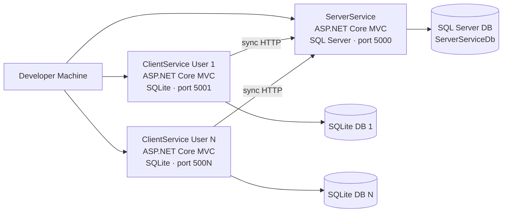
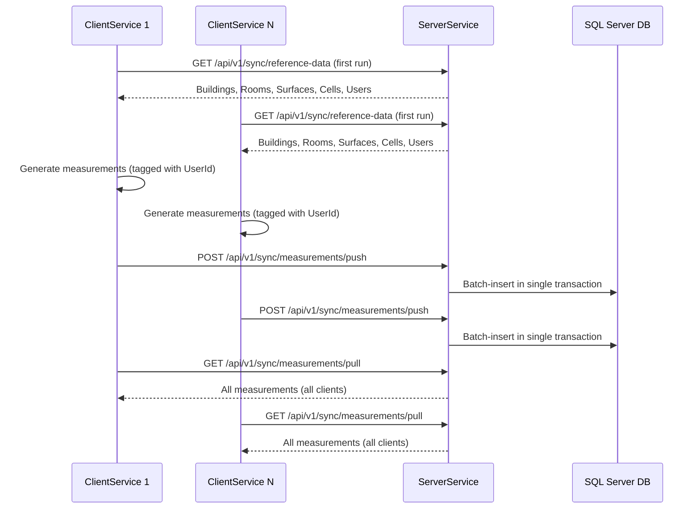

# Story 4.3: Architecture Overview Notes for Reuse

Status: ready-for-dev

<!-- Note: Validation is optional. Run validate-create-story for quality check before dev-story. -->

## Story

As a solution architect or senior developer,
I want concise architecture notes in the README,
so that I can quickly understand service responsibilities, data flows, and sync structure and decide how to reuse the pattern.

## Acceptance Criteria

1. **Given** I open the architecture overview section of the README  
   **When** I read through it once  
   **Then** I understand the high-level topology (ServerService, multiple ClientService instances, SQL Server, SQLite), key domain entities, and how data flows during sync.

2. **Given** I am evaluating Microserices-Sync for reuse in a real project  
   **When** I consult the architecture notes  
   **Then** I see a clear mapping from PRD concepts (FRs and NFRs) to the implemented structure, including where sync orchestration, seeding/reset, and diagnostics live.

3. **Given** a new architect or developer joins the team  
   **When** they read the README's architecture section and follow the links to deeper documents (such as the PRD and architecture decision doc)  
   **Then** they can explain back the core design and sync pattern within a short onboarding session without needing to read the entire codebase first.

## Tasks / Subtasks

- [ ] **Task 1: Audit README to confirm insertion point and absence of existing architecture section** (AC: #1, #2, #3)
  - [ ] 1.1 Open `MicroservicesSync/README.md`. Read the full file from top to bottom.
  - [ ] 1.2 Confirm the current section order (see Dev Notes for the full table). Specifically verify that `## Troubleshooting Unexpected Sync Outcomes` is the last section and that no `## Architecture` or `## Architecture Overview` section already exists.
  - [ ] 1.3 If any partial architecture content already exists (e.g., inline notes), note it to avoid duplication — do NOT create a second section.

- [ ] **Task 2: Insert `## Architecture Overview` section at the end of the README** (AC: #1, #2, #3)
  - [ ] 2.1 Append the new `## Architecture Overview` section **immediately after** the last content line of `## Troubleshooting Unexpected Sync Outcomes` (the "Step 5 — Confirm convergence after fixing" checklist). No other sections are added, modified, reorganized, or deleted.
  - [ ] 2.2 Write the **High-Level Topology** subsection with the Mermaid `graph LR` diagram (see Dev Notes for exact block). Ensure the diagram uses `graph LR` (not `graph TD`) to match the architecture decision document.
  - [ ] 2.3 Write the **Service Responsibilities** subsection with the two-column table describing ServerService and ClientService roles.
  - [ ] 2.4 Write the **Key Domain Entities** subsection with the entity-access table and a note on Guid PKs and concurrency tokens.
  - [ ] 2.5 Write the **Sync Data Flow** subsection with the Mermaid `sequenceDiagram` block (see Dev Notes for exact block) and the five-phase narrative.
  - [ ] 2.6 Write the **FR/NFR to Implementation Mapping** subsection with the full three-column table (FR/NFR → Implementation → Where).
  - [ ] 2.7 Write the **Solution Structure** subsection with the tree-style code block showing all six projects and key files.
  - [ ] 2.8 Write the **Reuse Guidance** subsection listing which components to lift and adapt.

- [ ] **Task 3: Final consistency review** (AC: #1, #2, #3)
  - [ ] 3.1 Read the updated README from top to bottom. Verify the new section reads as a standalone reference that does not duplicate information from earlier sections — cross-reference rather than repeat.
  - [ ] 3.2 Verify all anchor links inside the new section (e.g., `#direct-database-inspection`, `#viewing-sync-logs`) are valid. GitHub Markdown anchors are lowercase with spaces replaced by hyphens.
  - [ ] 3.3 Confirm that no `.cs` files, no `Dockerfile`, no `docker-compose.yml`, and no test project files are modified — this is a documentation-only story.
  - [ ] 3.4 Verify the Mermaid diagrams match exactly the topology described in relevant architecture sections: `ServerService → SqlServerDB`, `ClientService(N) → SqliteDB(N)`, no cross DB connections. Confirm sequence diagram shows reference pull → generation → push → pull → convergence in that order.
  - [ ] 3.5 Confirm the FR/NFR mapping table covers FR1–FR15 and NFR5 (the non-funcional requirements with direct implementation counterparts) and that each `Where` value names a real controller, project, or file that exists in the solution.

## Dev Notes

### Context: README State Entering Story 4.3

Stories 4.1 and 4.2 (both done) have built the README section by section. The README now has the following structure, in order:

| Section | Added in | Notes |
|---|---|---|
| Prerequisites | Story 4.1 | Full tool table — Docker, Git, .NET 10 SDK, VS 2022, SSMS, DB Browser |
| Quick Start — Before your first run | Story 4.1 | Clone + `.env` creation preamble |
| Quick Start — Start the services | Story 1.1 | `docker-compose up --build`, `up`, `down` |
| Verifying the Environment is Healthy | Story 1.2 | `/health` endpoints and `docker-compose ps` |
| Accessing the Service Home Pages | Story 4.1 | Added to Verifying section; home page URLs 5000–5005 with expected content |
| Scenario Parameters | Story 1.3 | `MeasurementsPerClient`, `BatchSize`, client count instructions |
| Reset to Clean Baseline | Story 1.5 | curl reset + pull-reference-data + UI buttons + expected entity counts table |
| Running Sync Scenarios | Story 4.2 | Scenario A (5×10) and Scenario B (3×5 edge case) |
| Running Tests | Epic 1 | `dotnet test` command |
| Direct Database Inspection | Story 3.3 | SSMS + DB Browser; `docker cp` for SQLite; diagnostic SQL queries |
| Viewing Sync Logs | Story 3.4 | `docker logs`, correlation ID tracing, log field descriptions |
| Troubleshooting Unexpected Sync Outcomes | Story 3.5 | 5-step investigation flow with symptom checklist |

**This story adds exactly one new section:** `## Architecture Overview`, appended at the very end of the README after `## Troubleshooting Unexpected Sync Outcomes`. No other sections are modified, reorganized, or deleted.

### Insertion Point

Append the new section immediately after the last content line of `## Troubleshooting Unexpected Sync Outcomes`. The last line of that section is the "Step 5 — Confirm convergence after fixing" closing checklist item:

```
3. **No duplicates**: The duplicate detection queries in Step 4 return 0 rows on all services.
```

The new `## Architecture Overview` heading starts immediately after that line with a blank line separator.

### Exact README Content for `## Architecture Overview`

Use the exact content below. Do not paraphrase, summarize, or restructure — this content was authored to match the acceptance criteria exactly.

---

```markdown
## Architecture Overview

This section explains service responsibilities, data flows, and the sync pattern structure for architects and developers evaluating Microserices-Sync for reuse. For the full set of architectural decisions (ADRs), see the [Architecture Decision Document](../_bmad-output/planning-artifacts/architecture.md) and the [Product Requirements Document](../_bmad-output/planning-artifacts/prd.md).

### High-Level Topology



The experiment runs fully locally via `docker-compose`. One `ServerService` container is the central source of truth. Five `ClientService` containers each represent a specific seeded user and maintain their own isolated SQLite database. No external cloud services are required.

### Service Responsibilities

| Service | Primary Responsibilities |
|---|---|
| **ServerService** (port 5000) | Stores all reference data (Buildings, Rooms, Surfaces, Cells, Users) and consolidated Measurements. Owns sync endpoints (`/api/v1/sync/measurements/push` and `/api/v1/sync/measurements/pull`). Provides full-CRUD jqGrid views for all entities. Records each sync operation as a `SyncRun` entry. Seeds reference data on startup. |
| **ClientService** (ports 5001–5005) | Creates measurements locally, pushes them to ServerService, pulls the consolidated dataset back. Full CRUD only for Measurements; all other entities are read-only (populated via reference-data pull). Each instance is bound to one seeded user via `ClientIdentity__UserId`. |

### Key Domain Entities

| Entity | Present in | ServerService | ClientService |
|---|---|---|---|
| `Measurement` | Both | Full CRUD | Full CRUD |
| `User` | Both | Full CRUD | Read-Only |
| `Building` | Both | Full CRUD | Read-Only |
| `Room` | Both | Full CRUD | Read-Only |
| `Surface` | Both | Full CRUD | Read-Only |
| `Cell` | Both | Full CRUD | Read-Only |
| `SyncRun` | ServerService only | Full CRUD | — |

All entities use `Guid` primary keys, ensuring uniqueness across services without coordination. Mutable entities carry concurrency tokens: `rowversion` (SQL Server) or a numeric integer (SQLite). Entity classes live in `Sync.Domain` — shared between both services with no persistence-specific code.

### Sync Data Flow



A complete sync run follows five phases:

1. **Reference pull (first run only)** — Each ClientService calls ServerService to populate Buildings, Rooms, Surfaces, Cells, and Users. After this initial pull the client database mirrors the server reference data.
2. **Measurement generation** — Each ClientService generates measurements locally, tagging each record with its own `UserId` GUID.
3. **Push** — ClientService calls `POST /api/v1/sync/measurements/push`. ServerService inserts all received measurements in configurable-size in-memory batches (default `BatchSize = 5`) within a single database transaction — all batches commit together or the entire push rolls back.
4. **Pull** — ClientService calls `GET /api/v1/sync/measurements/pull`. Received measurements are applied to the local SQLite database in the same single-transaction, batched pattern.
5. **Convergence** — After push and pull complete for all clients, every service holds the same full measurement set. The `Verify Convergence` button on each ClientService home page confirms this.

Each sync operation carries an `X-Correlation-Id` HTTP header that ties client-side and server-side log entries together. ServerService records each push/pull as a `SyncRun` row visible in the Sync Runs jqGrid.

### FR/NFR to Implementation Mapping

| Requirement | Implementation | Location |
|---|---|---|
| FR1 — one-command startup | `docker-compose up` | `docker-compose.yml` |
| FR2 — service health checks | `/health` endpoint on every container | `Program.cs` (health checks registration) |
| FR3 — configurable scenario parameters | `SyncOptions__MeasurementsPerClient`, `SyncOptions__BatchSize` env vars | `docker-compose.yml` |
| FR4 — database seeding | Startup seeder seeds reference tables on ServerService from CSV data | `Sync.Infrastructure` seeder, `Program.cs` |
| FR5 — clean baseline reset | `POST /api/v1/admin/reset` + `POST /api/v1/admin/pull-reference-data` | `AdminController` on both services |
| FR6 — core sync scenario (push/pull) | Batched transactional push+pull endpoints + UI buttons | `SyncController` (ServerService), `HomeController` (ClientService) |
| FR7 — edge-case scenario variant | Scenario B: 3 clients × 5 measurements × BatchSize=2 (configuration only) | `docker-compose.yml` environment overrides |
| FR8 — convergence guarantee | GUID deduplication + single-transaction batched operations | `Sync.Application` push/pull services |
| FR9 — repeatable runs from clean baseline | Idempotent seeding + reset mechanism | `AdminController`, `Sync.Infrastructure` |
| FR10 — sync run summary view | `SyncRuns` jqGrid on ServerService home page | `SyncRunsController`, `HomeController` |
| FR11 — data inspection via jqGrid | jqGrid tables on both service home pages + DB inspection guide | `HomeController`, [Direct Database Inspection](#direct-database-inspection) |
| FR12 — logs and diagnostics | Structured logging with `CorrelationId`/`SyncRunId` per operation | `Sync.Application`, [Viewing Sync Logs](#viewing-sync-logs) |
| FR13 — README prerequisites + quickstart | Prerequisites and Quick Start sections | README |
| FR14 — scenario guide | Running Sync Scenarios section | README |
| FR15 — architecture notes | This section | README |
| NFR5 — SQL injection prevention | EF Core parameterized queries; whitelisted + LINQ-translated jqGrid params | `Sync.Infrastructure` repositories, API controllers |

### Solution Structure

```
MicroservicesSync/
├── ServerService/               ← ASP.NET Core MVC + SQL Server (port 5000)
│   ├── Controllers/             ← HomeController, entity API controllers, AdminController, SyncController
│   └── Views/Home/              ← Index.cshtml hosting all jqGrids
├── ClientService/               ← ASP.NET Core MVC + SQLite (ports 5001–5005)
│   ├── Controllers/             ← HomeController (sync trigger actions), entity API controllers, AdminController
│   └── Views/Home/              ← Index.cshtml with Measurements CRUD + sync buttons
├── Sync.Domain/                 ← Shared entities (Guid PK, concurrency tokens, no persistence code)
├── Sync.Application/            ← Sync orchestration (push, pull, batching), service interfaces, DTOs
├── Sync.Infrastructure/         ← EF Core DbContexts (ServerDbContext / ClientDbContext), repositories, seeders
├── MicroservicesSync.Tests/     ← Integration tests targeting sync convergence and admin flows
├── docker-compose.yml           ← Full environment: ServerService, 5 × ClientService, sqlserver
└── docker-compose.override.yml  ← Development-time overrides (port mappings, volume paths)
```

**Clean/Onion layering (enforced by project references):**

```
Sync.Domain
    ↑
Sync.Application  (references Domain only)
    ↑
Sync.Infrastructure  (references Domain + Application)
    ↑
ServerService / ClientService  (reference Application + Infrastructure)
```

No Infrastructure project references web projects. No EF Core calls appear in controllers — all data access is proxied through Application services and repository interfaces.

### Reuse Guidance

To lift the sync pattern into a new project, the following components are the most portable:

| Component | What to copy | Where to find it |
|---|---|---|
| Sync orchestration | Push/pull services with single-transaction batching and conflict detection | `Sync.Application` |
| Repository abstractions | `IReadOnlyRepository<T>` and `IRepository<T>` with jqGrid-friendly `GetPaged` | `Sync.Infrastructure` |
| Database reset / seed pattern | `AdminController` reset + seeder startup logic for test-environment baselines | `AdminController`, `Sync.Infrastructure` seeders |
| jqGrid integration | `HomeController` + jqGrid Razor views, per-entity API controller shape | `ServerService/Controllers`, `ServerService/Views/Home` |
| Docker topology | Multi-service compose file with per-user volumes and environment-variable topology | `docker-compose.yml` |

For detailed architectural rationale and decision records (ADR-001: solution layout, ADR-002: per-user client identity), see the [Architecture Decision Document](../_bmad-output/planning-artifacts/architecture.md).
```

---

### Notes on Mermaid Diagram Rendering

- GitHub renders Mermaid natively in Markdown files. No plugin or extra configuration is needed.
- The `graph LR` (left-to-right) layout is used to match the topology diagram in the Architecture Decision Document.
- The `sequenceDiagram` uses participant aliases matching the actual container naming convention (`ClientService 1`, `ClientService N`, `ServerService`, `SQL Server DB`).
- Do NOT switch to `graph TD` (top-down) — the existing architecture doc uses `graph LR` and consistency is required.

### Notes on the FR/NFR Mapping Table

- Cover FR1–FR15 (all 15 functional requirements) plus NFR5 (the only NFR with a direct code counterpart — SQL injection prevention).
- NFR1–NFR4 and NFR6–NFR7 are validated by the environment setup and test results, not by a single code location; they are intentionally omitted from the table to keep it actionable.
- The `Where` column must reference real implementation locations: controller class name, project name, or README anchor. Do not use vague phrases like "application layer."

### Notes on Solution Structure Tree

- Include only the six projects that make up the solution (`ServerService`, `ClientService`, `Sync.Domain`, `Sync.Application`, `Sync.Infrastructure`, `MicroservicesSync.Tests`) and the two compose files.
- Do not list every file or sub-folder — the tree should be navigational, not exhaustive.
- The layering diagram below the tree must match the actual project reference graph established in Story 1.1.

### This Is a Documentation-Only Story

No changes to `.cs` files, `Dockerfile`, `docker-compose.yml`, or test project files are required or allowed. The only file modified is `MicroservicesSync/README.md`. If the dev agent attempts to change any source file, that is a mistake.

### Project Structure Notes

- Alignment with unified project structure: the story modifies only `MicroservicesSync/README.md`.
- No naming or convention changes in source code are introduced.
- The relative paths used in the deep-document links (`../_bmad-output/planning-artifacts/architecture.md` and `prd.md`) assume the README is at `MicroservicesSync/README.md` and the planning artifacts are at `_bmad-output/planning-artifacts/` relative to the workspace root. Verify this is correct before setting the final link path — if the README or documents live at different relative levels, adjust accordingly.

### References

- Epic 4 story definitions: [Source: _bmad-output/planning-artifacts/epics.md#Story 4.3]
- High-level topology diagram: [Source: _bmad-output/planning-artifacts/architecture.md#System Overview Diagram]
- Sync sequence diagram: [Source: _bmad-output/planning-artifacts/architecture.md#Sync Flow Diagram (Multi-Client Scenario)]
- FR coverage map: [Source: _bmad-output/planning-artifacts/epics.md#FR Coverage Map]
- API contracts (push/pull endpoints): [Source: _bmad-output/planning-artifacts/architecture.md#Inter-service communication and sync endpoints]
- Solution structure and project references: [Source: _bmad-output/planning-artifacts/architecture.md#ADR-001 – Base Solution Layout and Starters]
- Per-user client identity topology: [Source: _bmad-output/planning-artifacts/architecture.md#ADR-002 – Per-User Client Identity & Storage Isolation]
- Project context rules: [Source: _bmad-output/project-context.md]
- Previous story dev notes (README state after 4.2): [Source: _bmad-output/implementation-artifacts/4-2-scenario-guide-for-core-and-edge-case-sync-runs.md#Dev Notes]

## Dev Agent Record

### Agent Model Used

{{agent_model_name_version}}

### Debug Log References

### Completion Notes List

### File List
