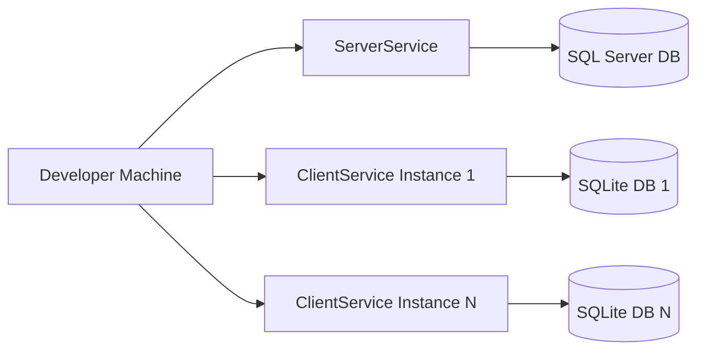
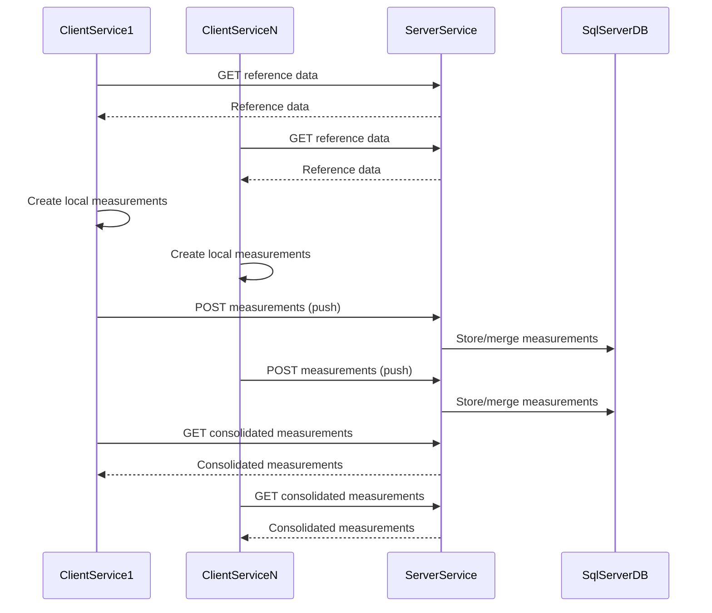

# Architecture Decision Document

_This document builds collaboratively through step-by-step discovery. Sections are appended as we work through each architectural decision together._

## Audience & Usage

- **Audience:** Architects, backend/API developers, and QA engineers working on or reusing the Microserices-Sync experiment.
- **Purpose:** Acts as the primary source of truth for technical decisions that guide implementation and validation.
- **How to use:** Read this document alongside the PRD, project-context, and epics/stories to understand the intended structure, data flows, and sync behaviors before making code or infrastructure changes.

Related artifacts:
- Product Brief: `_bmad-output/planning-artifacts/product-brief-Microserices-Sync-2026-02-27.md`
- PRD: `_bmad-output/planning-artifacts/prd.md`
- Project Context: `_bmad-output/project-context.md`

## Project Context Analysis

### Requirements Overview

**Functional Requirements:**
The functional requirements define a self-contained experimental environment where developers can reliably bring up two microservices (ClientService and ServerService) via Docker, seed and reset their databases to a known baseline, and run repeatable multi-client sync scenarios.

Architecturally, this implies:
- A clear separation of concerns between ClientService (emulating HoloLens-like behavior) and ServerService (central source of truth), each with its own database and container.
- Well-structured startup/hosting and configuration layers so that a single docker-compose entrypoint can orchestrate all services with minimal manual steps (FR1–FR3).
- A deterministic seeding/reset pipeline (FR4–FR5) that can re-establish a clean schema and baseline data in both databases, likely via scripts or startup routines tied into container lifecycles.
- Sync flows that support multiple ClientService instances generating measurements independently, pushing to ServerService, and then pulling back the consolidated dataset (FR6–FR9). This demands careful handling of IDs, timestamps/versions, and conflict rules so that all services converge to identical measurement sets.
- Simple but complete diagnostics and inspection capabilities (FR10–FR12): jqGrid-based tables on both services, access to DB tooling, and logs that make sync behavior inspectable without deep infrastructure knowledge.
- A strong emphasis on documentation and developer guidance (FR13–FR15), meaning the architecture must stay understandable, with clear service responsibilities and data flows that can be explained directly in the README.

**Non-Functional Requirements:**
The non-functional requirements shape the architecture toward reliability, repeatability, and developer ergonomics rather than scale-out production concerns:

- Performance expectations (NFR1) focus on keeping sync scenarios fast enough on a typical laptop; this encourages simple, predictable data flows and modest data volumes rather than heavy batching or complex processing.
- Reliability and repeatability (NFR2–NFR3) require that the system consistently converges across multiple runs, reinforcing the need for:
  - Idempotent or well-defined sync operations.
  - Strong guarantees around seed/reset processes.
  - Deterministic conflict resolution and data merging.
- Security constraints (NFR4–NFR5) are intentionally minimal but still require safe data access patterns (e.g., parameterized queries/ORM), even in a non-production experiment.
- Environment and integration expectations (NFR6–NFR7) lock in a local-first architecture: Docker, SQL Server, SQLite, and Visual Studio. This favors straightforward networking, local persistence via volumes, and minimal external dependencies.

**Scale & Complexity:**
Overall, the project is scoped as a medium-complexity developer tool / experiment:

- Primary domain: backend/API developer infrastructure with two web services and supporting databases, plus simple HTML/jqGrid UIs.
- Complexity level: medium — the service count and UI needs are modest, but multi-client sync, deterministic data integrity, and environment repeatability add meaningful architectural depth.
- Estimated architectural components: a small set of core components per service (web/API layer, data access layer, sync orchestration logic, seeding/reset mechanisms, logging/diagnostics) plus shared configuration/environment orchestration via docker-compose.

The complexity is driven more by correctness and clarity of sync behavior than by feature breadth or user-facing UX sophistication.

### Technical Constraints & Dependencies

From the project context and PRD, the key constraints and dependencies are:

- Technology stack is fixed to:
  - .NET 10 ASP MVC for both ClientService and ServerService.
  - SQL Server for ServerService, SQLite for ClientService.
  - Docker and docker-compose as the primary orchestration mechanism.
- Architecture must support:
  - Two microservices with aligned data models (Buildings, Rooms, Surfaces, Cells, Measurements, Users) and consistent table structures across databases.
  - RESTful APIs for CRUD and sync operations, with change tracking via timestamps/versions and GUID-based primary keys for Measurements to ensure uniqueness across clients.
- Environment and tooling assumptions:
  - Windows + Visual Studio as the primary developer environment.
  - Local runner expectations (no external cloud dependencies) with Docker volumes for persistence and logs.
- Security and data assumptions:
  - No real users or authentication/authorization; all actions are simulated.
  - Only artificial, non-sensitive data, but still implemented with safe data access patterns.
- Experiment framing:
  - The project is explicitly pre-production and designed to be understandable, modifiable, and re-runnable by future developers and architects.

These constraints narrow technology choices and push the architecture toward transparency and maintainability over generality or extensibility.

### Cross-Cutting Concerns Identified

Several concerns will cut across services and layers:

- **Data Integrity & Sync Correctness:** Ensuring all clients and the server converge to the same measurement set, across repeated runs and scenario variants. This affects data modeling, sync endpoints, conflict resolution rules, and testing/validation approaches.
- **Seeding & Reset Mechanisms:** Providing reliable, idempotent seed and reset flows for both databases, tied into docker-compose or explicit tooling, so developers can always return to a known baseline.
- **Logging, Diagnostics & Observability:** Capturing enough information about sync runs (what changed, how many records, which client) to debug issues and validate behavior, without over-complicating the experiment.
- **Configuration & Environment Orchestration:** Centralizing configuration for things like number of clients and measurement volumes, and keeping the docker-compose and service configuration simple and consistent.
- **Developer Experience & Documentation:** Maintaining a structure that matches the README and scenario guides, so new developers can map architecture to usage instructions directly.
- **Security Hygiene:** Even without real auth, using safe data access patterns and avoiding accidental bad practices, so the experiment remains a good reference.

These cross-cutting concerns will drive many of the upcoming architectural decisions, particularly around data flow, service boundaries, and operational tooling.

### Additional Multi-Agent Insights (Party Mode)

From a combined Architect, Developer, QA, and PM perspective, the experiment framing of Microserices-Sync has several implications:

- The architecture should prioritize clarity and liftability over generality: sync flows, data models, and service boundaries must be simple enough to copy into a real project with minimal pruning of experiment-only pieces.
- Seeding and reset are not just operational conveniences but core architectural capabilities: they underpin repeatability, testability, and trust in the experiment’s results.
- The system benefits from being scriptable and automatable: the way scenarios are triggered and validated (including data checks) should be easy to drive from tests or simple scripts, not only via manual UI actions.
- The overall design should support a simple narrative for stakeholders: “two services, one source of truth, repeatable sync scenarios that always converge,” making it easy to justify reuse in future projects.

## Starter Template Evaluation

### Primary Technology Domain

Backend/API–first ASP.NET Core solution with **two MVC-based microservices** (ServerService and ClientService), each exposing:
- A thin Razor UI via a single `HomeController` (`Index()` hosting all jqGrids and, on ClientService, sync actions).
- Per-entity API controllers with jqGrid-friendly endpoints.

Shared class libraries (Domain, Application/Services, Infrastructure/Repositories) provide a **clean/onion architecture** that both services consume.

### System Overview Diagram



This diagram summarizes the local experiment setup: a docker-compose–orchestrated environment running one ServerService instance (using its own SQL Server database), and one or more ClientService instances (each using its own separate SQLite database). The ClientService instances do not use the SQL Server database.

---

### Architecture Decision Record – Solution & Starter Structure

**ADR-001 – Base Solution Layout and Starters**

- **Status:** Proposed  
- **Date:** 2026-03-02  
- **Decision Owner:** Eugen (with Architect agent support)

#### Context

Microserices-Sync is an experiment, not a product, but it must:
- Be easy to **run, inspect, and modify** by future developers.
- Represent a realistic pattern for **two services** (ClientService, ServerService) with **different databases** (SQLite vs SQL Server).
- Demonstrate **clean layering and reusability**, so core logic and models can be lifted into future projects.
- Support a simple jqGrid-based UI on each service without introducing a heavy frontend stack.

We want:
- Standard, well-supported .NET templates rather than custom scaffolding.
- A single Visual Studio–friendly solution hosting both services and shared code.
- A structure that maps cleanly to domain-model and sync concepts from the PRD.

#### Options Considered

1. **Two Web API projects + bolt-on Razor UI**
   - `dotnet new webapi` for each service, then add MVC/Razor support and a Home page manually.
   - Pros: Minimal initial footprint, very API-centric.
   - Cons: Extra setup for views/layouts; more friction to get to “one HomeController + jqGrids” on each service.

2. **Two MVC projects (ServerService and ClientService) + shared class libraries (Selected)**
   - `dotnet new mvc` for each service, plus:
     - `Sync.Domain` for shared entities and core concepts.
     - `Sync.Application` for services/use-cases (including sync orchestration).
     - `Sync.Infrastructure` for repository implementations and DB access.
   - Pros: UI + API support out of the box; cleanly expresses “one HomeController + separate API controllers” per service; aligns well with clean/onion layering.
   - Cons: Slightly more initial surface area than pure Web API templates.

3. **Single large web project hosting both Client and Server concerns**
   - One MVC/Web API project with areas or routes to simulate two services.
   - Pros: Fewer projects to manage initially.
   - Cons: Blurs service boundaries; complicates Docker/containerization, DB separation, and future reuse; contradicts “two microservices” goal.

#### Decision

We will use **Option 2 – two MVC projects with shared class libraries**:

- One solution:
  - `ServerService` (ASP.NET Core MVC) – SQL Server backend.
  - `ClientService` (ASP.NET Core MVC) – SQLite backend per instance.
  - `Sync.Domain` – domain entities and value objects.
  - `Sync.Application` – application services and sync orchestration logic.
  - `Sync.Infrastructure` – repository implementations and DB access logic (with awareness that some pieces may differ per service).

- Each web project will:
  - Expose a `HomeController` with `Index()` that:
    - Renders jqGrids for all relevant entities.
    - On ClientService, also exposes sync actions (push/pull) wired to application services.
  - Define API controllers per entity (e.g., `BuildingsController`) with jqGrid-friendly endpoints:

    - `GetById(Guid id)`
    - `GetPaged(int page = 1, int pageSize = 10, string? sortBy = null, string? sortOrder = null, string? filters = null)`
    - `Create(BuildingCreateDto dto)`
    - `Update(Guid id, BuildingUpdateDto dto)`
    - `Delete(Guid id)`

#### Consequences

**Positive:**

- Clear mapping from PRD concepts to code:
  - Two real services, two real DBs, explicit sync flows, shared domain.
- Clean layering that matches standard **clean/onion** guidance:
  - Web (MVC/API) → Application → Domain; Infrastructure → Domain.
- Easy to reason about and **lift** into a future project: shared libs are already factored.
- JqGrid integration is straightforward: everything lives in a single Home view per service.

**Negative / Trade-offs:**

- More projects to manage (solution complexity) compared to a single-project approach.
- `Sync.Infrastructure` must be designed carefully so ServerService’s SQL Server specifics and ClientService’s SQLite specifics do not get entangled (we may later split into `Server.Infrastructure` and `Client.Infrastructure` if needed).
- Additional test projects (when added) will also plug into this matrix (Domain/Application/Infrastructure) and must be kept organized.

---

### Selected Starter and Initialization Command

**Selected Starter:**  
ASP.NET Core MVC projects for **ServerService** and **ClientService** plus three shared class libraries (`Sync.Domain`, `Sync.Application`, `Sync.Infrastructure`) assembled into a single solution.

**Initialization Command (example scaffold):**

```bash
# Create solution
dotnet new sln -n MicrosericesSync

# Create web (MVC) projects
dotnet new mvc -n ServerService
dotnet new mvc -n ClientService

# Create shared class libraries
dotnet new classlib -n Sync.Domain
dotnet new classlib -n Sync.Application
dotnet new classlib -n Sync.Infrastructure

# Add projects to solution
dotnet sln MicrosericesSync.sln add \
  ServerService/ServerService.csproj \
  ClientService/ClientService.csproj \
  Sync.Domain/Sync.Domain.csproj \
  Sync.Application/Sync.Application.csproj \
  Sync.Infrastructure/Sync.Infrastructure.csproj

# Set up project references (clean/onion layering)
dotnet add Sync.Application/Sync.Application.csproj reference Sync.Domain/Sync.Domain.csproj
dotnet add Sync.Infrastructure/Sync.Infrastructure.csproj reference Sync.Domain/Sync.Domain.csproj
dotnet add ServerService/ServerService.csproj reference Sync.Application/Sync.Application.csproj Sync.Infrastructure/Sync.Infrastructure.csproj
dotnet add ClientService/ClientService.csproj reference Sync.Application/Sync.Application.csproj Sync.Infrastructure/Sync.Infrastructure.csproj
```

**Architectural Decisions Provided by Starter (Summary):**

- **Language & Runtime:** C# on modern .NET; MVC pipeline plus API controllers.
- **Styling & UI:** Razor views with minimal assets, easy jqGrid integration on a single Home page.
- **Build & Tooling:** Standard `dotnet` pipeline; Visual Studio–friendly; straightforward Dockerization.
- **Code Organization:** Two MVC web projects + three shared libs enforcing clean/onion architecture.
- **Development Experience:** Single solution, clear boundaries, and a structure that matches how future projects will likely be organized.

**Note:** Initial project scaffolding using these commands and references should be one of the first implementation stories, followed immediately by Docker/docker-compose setup and basic seeding/reset scripts.

## Core Architectural Decisions

### Data Architecture

**Databases and modeling:**
- EF Core code-first in `Sync.Infrastructure` with two DbContexts: `ServerDbContext` (SQL Server) and `ClientDbContext` (SQLite).
- Shared entity types for all tables (Buildings, Rooms, Surfaces, Cells, Measurements, Users, etc.) live in `Sync.Domain`, with aligned table/column names across providers to keep sync mapping simple.

**Primary keys and identities:**
- All entities use `Guid` primary keys; all foreign keys are also `Guid` to keep references consistent across services.
- ServerService is the authority for reference data creation (e.g., Buildings, Rooms, Surfaces, Cells, Users), but clients consume the same GUIDs once synced.

**Concurrency and change tracking:**
- All mutable entities include a concurrency token:
  - SQL Server: `rowversion` / `byte[]` column configured as a concurrency token.
  - SQLite: numeric/integer column configured as a concurrency token.
- Timestamps plus concurrency tokens are used in `Sync.Application` to detect and resolve conflicts during sync.

**Seeding, initial state, and first sync:**
- On first `docker-compose` startup:
  - ServerService database is seeded with all tables **except Measurements** (reference data such as Buildings, Rooms, Surfaces, Cells, Users, etc. are populated; Measurements initially empty).
  - Each ClientService database starts completely empty (no rows in any tables).
- First sync behavior:
  - An initial **pull** from ServerService populates all non-measurement tables on each ClientService, making them mirror the server’s reference data.
  - Measurements are then created on clients and later pushed/pulled as part of the experiment scenarios.
- Reset behavior:
  - A "clean & seed" operation reseeds ServerService as above (all tables except Measurements) and clears all ClientService databases to empty, restoring the same first-pull pattern.

**Validation and caching:**
- Basic shape/range validation via Data Annotations on entities/DTOs; richer business rules live in `Sync.Application`.
- No dedicated cache layer for MVP; rely on database indexes plus EF tracking, prioritizing correctness and transparency over micro-optimizations.

### API & Communication Patterns

**API style and routing:**
- RESTful JSON APIs implemented via ASP.NET Core MVC with `[ApiController]` for all entity controllers.
- Single logical API version (`v1`) expressed through route prefixes (for example, `/api/v1/buildings`).

**Per-entity controllers and jqGrid contracts:**
- Per-entity controllers on both services (e.g., `BuildingsController`) expose jqGrid-oriented endpoints:
  - `GetById(Guid id)`
  - `GetPaged(int page = 1, int pageSize = 10, string? sortBy = null, string? sortOrder = null, string? filters = null)`
  - `Create(...)`
  - `Update(Guid id, ...)`
  - `Delete(Guid id)`
- jqGrid responses follow jqGrid’s expected shape (page, total, records, rows[...]) so the UI configuration remains thin.

**CRUD capability differences (Server vs Client):**
- **ServerService:** All entities/models are full CRUD:
  - jqGrids on ServerService support full editing for all tables (create, update, delete, paging, sorting, filtering).
- **ClientService:** Only `Measurements` is full CRUD; all other tables are read-only:
  - jqGrids for reference entities (Buildings, Rooms, Surfaces, Cells, Users, etc.) allow paging, sorting, filtering, and optional "view details" (GetById), but no create/update/delete.
  - The Measurements grid on ClientService supports full CRUD, reflecting the primary client-side write path.

**HomeController and UI endpoints:**
- Each service exposes a single `HomeController` with an `Index()` action that renders the main Razor view hosting all jqGrids for that service.
- ClientService `HomeController` additionally exposes sync trigger actions (for example, `Push()` and `Pull()`) that delegate to `Sync.Application` services.

**Inter-service communication and sync endpoints:**
- ClientService communicates with ServerService via HTTP/JSON:
  - Server base URL is configured via environment variables (for example, `SERVER_BASE_URL`).
  - Sync endpoints on ServerService are exposed under a dedicated prefix such as `/api/v1/sync/...`.
- High-level sync contract:
  - **Push:** `POST /api/v1/sync/measurements/push` from ClientService to ServerService with batches of Measurement DTOs plus client identity/metadata.
  - **Pull:** `GET /api/v1/sync/measurements/pull` from ClientService to ServerService, optionally parameterized (for example, "since last sync").
- Sync orchestration and conflict handling are implemented in `Sync.Application`, using GUID IDs, timestamps, and concurrency tokens from the data layer.

### Sync Flow Diagram (Multi-Client Scenario)



This sequence diagram illustrates a typical multi-client sync run: seed reference data on the server, pull reference data to each client, create local measurements, then push and pull to converge all services on the same measurement set.

**Service and repository layering (read-only vs full CRUD):**
- Repository and service layers are shared where possible between services:
  - A generic **read-only base repository/service** abstraction (e.g., `IReadOnlyRepository<T>` / `ReadOnlyRepository<T>`) provides `GetById` and `GetPaged` behavior for all entities.
  - A derived **full-CRUD repository/service** abstraction (e.g., `IRepository<T>` / `Repository<T>`) extends the base with `Create`, `Update`, and `Delete` operations.
- ServerService uses the full-CRUD repositories/services for all entities.
- ClientService uses:
  - Full-CRUD repositories/services only for `Measurements`.
  - Read-only repositories/services for all other tables, matching the read-only UI behavior.
- This pattern keeps the codebase consistent across services while making the Server vs Client capabilities explicit in the architecture.

### Authentication & Security

**Authentication and authorization:**
- No authentication or authorization is implemented on either microservice.
- All HTTP endpoints on ServerService and ClientService are open within the experiment environment; the security boundary is the local/docker environment rather than app-level user identity.
- This aligns with the PRD’s positioning of Microserices-Sync as an internal developer experiment using only artificial, non-sensitive data.

**Security scope and data sensitivity:**
- The system operates only on synthetic, non-sensitive data; no production or personal data is processed.
- As a result, advanced security features (identity providers, role-based access control, audit trails, etc.) are explicitly out of scope for the MVP.

**SQL injection prevention (primary security requirement):**
- All data access is implemented via EF Core with parameterized queries; no dynamic SQL string concatenation with untrusted input.
- Where raw SQL must be used (for example, for specialized queries or seeding), it is executed through parameterized APIs provided by EF Core or ADO.NET, never via string interpolation of user input.
- jqGrid filter and sorting parameters (such as `sortBy`, `sortOrder`, and `filters`) are:
  - Validated/whitelisted at the controller or application-service level (for example, column names mapped from a known, fixed set).
  - Translated into strongly-typed LINQ expressions instead of being injected directly into SQL fragments.
- This satisfies the PRD’s requirement that SQL injection be prevented even in a non-production, experiment-focused environment.

**Other basic safeguards:**
- Connection strings and other configuration values are provided via environment variables or configuration files, not hard-coded into source.
- Services are expected to run inside a controlled docker-compose network during normal use; exposing them publicly would require additional hardening that is intentionally out of scope for this experiment.

### Infrastructure & Deployment

**Hosting model:**
- The entire experiment runs locally via `docker-compose` on a developer machine; no cloud or external infrastructure is required.
- Compose file defines at least:
  - One `ServerService` container (ASP.NET Core MVC + SQL Server client libraries).
  - One or more `ClientService` containers (ASP.NET Core MVC + SQLite), scaled by changing compose configuration.
  - A `sqlserver` container hosting the ServerService database.
- All containers share a private Docker network; no public ingress is required for normal use.

**Persistence and volumes:**
- SQL Server data is stored in a named Docker volume attached to the `sqlserver` container.
- Each `ClientService` container uses a mounted volume or container filesystem path for its SQLite database file, ensuring data persists across container restarts for the duration of an experiment run.
- Separate volumes or bind mounts are used for application logs (both services) so sync runs can be inspected without attaching debuggers.

**Configuration and environments:**
- Standard ASP.NET Core configuration layering is used (appsettings.json, appsettings.Development.json, environment variables), with docker-compose supplying environment-specific values such as:
  - Database connection strings for ServerService.
  - File paths or connection strings for ClientService SQLite databases.
  - Server base URL (`SERVER_BASE_URL`) for ClientService to call ServerService APIs.
- A single docker-compose entrypoint acts as the primary way to start all services and dependencies in a consistent way, matching the PRD’s “clone + compose” usage model.

**Build and run flow:**
- Developers can run the solution directly from Visual Studio for focused debugging against local SQL Server / SQLite instances, or run the full environment via `docker-compose` for end-to-end scenarios.
- Container images for `ServerService` and `ClientService` are built using per-project Dockerfiles aligned with the .NET SDK/runtime images, keeping the runtime environment close to local development.

**CI/CD and deployment scope:**
- Formal CI/CD pipelines and production deployment are explicitly out of scope for the MVP; the primary “deployment” target is the local docker-compose environment described in the PRD.
- If CI is added later, it should:
  - Build and test the solution using `dotnet` commands.
  - Optionally build Docker images and run a minimal compose-based smoke test, mirroring the developer workflow.

**Monitoring and observability:**
- Observability for the experiment relies on:
  - Application logs captured in volumes or standard container output.
  - Simple database inspection via SQL Server Management Studio and a SQLite viewer.
- Full observability stacks (APM, distributed tracing, metrics dashboards) are intentionally deferred; the focus is on making sync behavior inspectable through logs, DB contents, and jqGrid views.

#### ADR-002 – Per-User Client Identity & Storage Isolation

- **Status:** Proposed  
- **Date:** 2026-03-02  
- **Decision Owner:** Eugen (with Architect agent support)

##### Context

For the Microserices-Sync experiment, we want to:
- Seed the `Users` table in ServerService from a CSV/Excel file on first run.
- Run **exactly five** ClientService instances, each representing a specific seeded user.
- Give each client instance its own persistent SQLite database and log storage so runs can be isolated, inspected, and repeated.

We need a deterministic mapping between:
- Seeded users in the CSV/Excel (each with a stable `UserId` GUID), and
- Concrete client containers and their storage (DB + logs).

##### Decision

For the MVP, we will **hardcode a 5×5×5 topology**:

- The seed CSV/Excel will define **exactly five users**, each with a stable `UserId` (GUID).
- `docker-compose` will define **five ClientService containers**, each:
  - Configured with a per-container environment variable `ClientIdentity__UserId` that matches one of the seeded `UserId` GUIDs.
  - Bound to a **dedicated SQLite data volume** for that user.
  - Bound to a **dedicated logs volume** for that user.
- ClientService reads `ClientIdentity__UserId` at startup (via configuration binding) and uses it to:
  - Tag locally created measurements with the correct `UserId`.
  - Resolve the corresponding user record after the initial reference-data pull.

Illustrative `docker-compose` sketch (names only; actual GUIDs live in seed + compose files):

```yaml
services:
  client_user1:
    image: microserices-sync-client
    environment:
      - ClientIdentity__UserId=<User1-Guid>
    volumes:
      - client_user1_db:/data
      - client_user1_logs:/logs

  client_user2:
    image: microserices-sync-client
    environment:
      - ClientIdentity__UserId=<User2-Guid>
    volumes:
      - client_user2_db:/data
      - client_user2_logs:/logs

  # ... repeat for client_user3, client_user4, client_user5 ...

volumes:
  client_user1_db:
  client_user1_logs:
  client_user2_db:
  client_user2_logs:
  client_user3_db:
  client_user3_logs:
  client_user4_db:
  client_user4_logs:
  client_user5_db:
  client_user5_logs:
```

##### Consequences

**Positive:**
- Clear, one-to-one mapping between **seeded user**, **client container**, and **persistent storage**.
- Repeatable experiments: each user’s state (DB + logs) can be preserved across container restarts.
- Diagnostics are simpler: logs and DB contents are naturally partitioned by user.

**Trade-offs / constraints:**
- The MVP topology is fixed to **five** users and **five** client containers; changing this requires updating both the seed file and `docker-compose` configuration.
- More dynamic or large-scale user/client provisioning would require a different pattern (this ADR is intentionally optimized for a small, explicit experiment setup).
